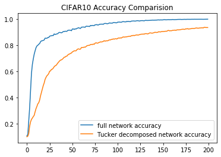
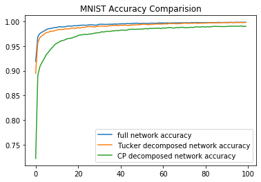

# Tensor_Layer_for_Deep_Neural_Network_Compression
Apply CP, Tucker, TT/TR, HT to compress neural networks. Train from scratch.

## CP 
CP decomposition works fine with classifying the MNIST dataset, it can compress the network without significant loss in accuracy compared to the original, uncompressed network. However, CP cannot has many problems dealing with larger networks such as VGG for CIFAR10. The decomposition not only takes an intolerably long time, but it also consumes a lot of RAM. For a convolutional layer with size larger than 512 x 512, the CP decompositon becomes infeasible in terms of memory. Moreover, the CP decomposed network is highly sensitive to the learning rate, and requires the learning rate to be as small as 1e-5 for learning to take place.

## Tucker
Tucker decomposition is strictly superior to CP in almost every way. It has more sucess decomposing larger networks, and requires less resources in terms of runtime and memory. It is also more tolerant to larger values of learning rates, allowing the network to learn faster. The network decomposed with Tucker also learns faster, i.e., yields greater accuracy in fewer epochs (see the analysis of performance graphs for details).

## Graphs
 
For the uncompressed network, the average time for each epoch is around 38 seconds, while the average time for the Tucker-decomposed network is 28 seconds.  

From this performance graph, we can see that the Tucker-decomposed network learns much faster than the CP-decomposed net.  In terms of run time, the three networks do not differ from each other significantly.
